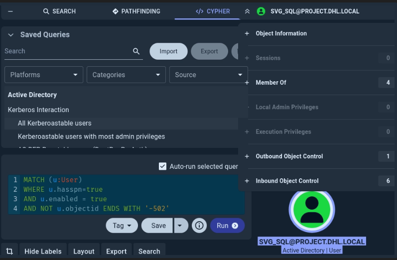
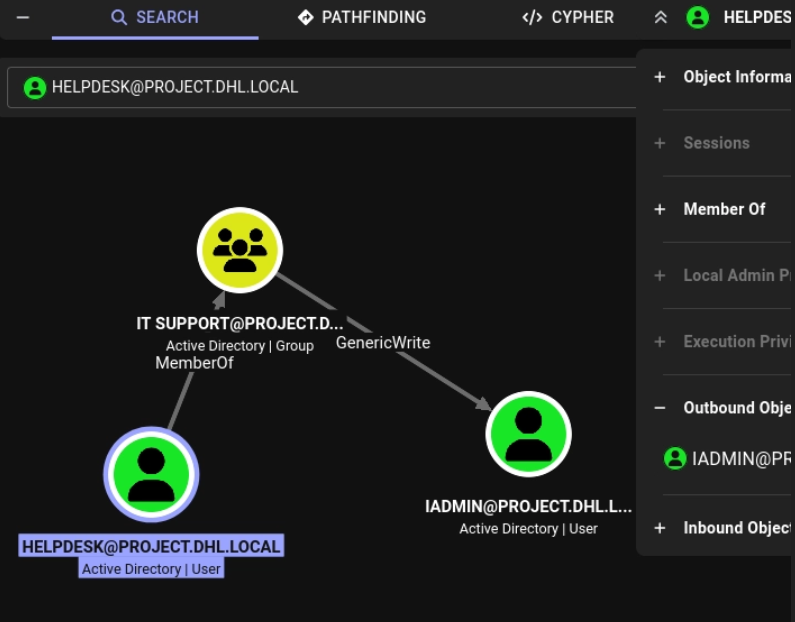
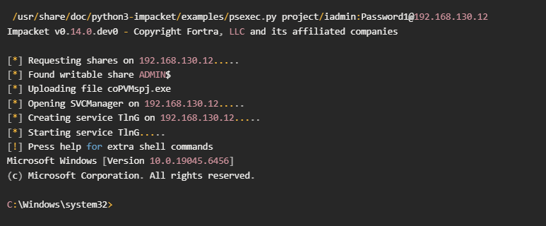
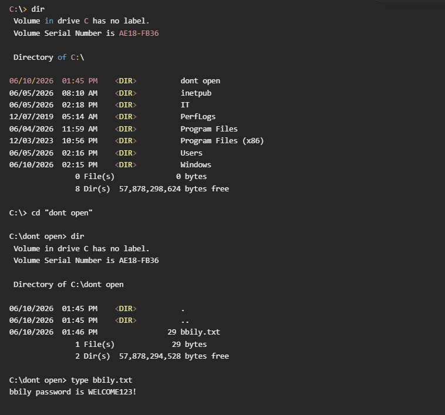
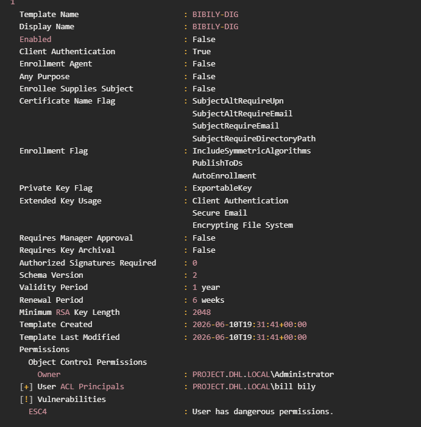
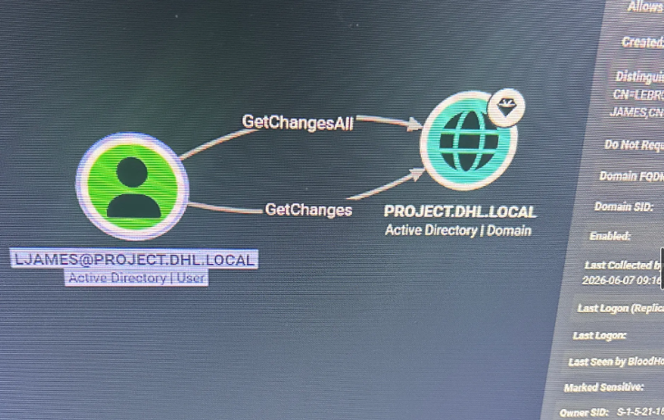

# Active Directory Homelab - Attack Path 1

## Overview

I built this Active Directory homelab to practice realistic Active Directory attack paths and improve my understanding of enumeration, Kerberos attacks, ACL abuse, ADCS abuse, and domain compromise.

The objective was to chain multiple misconfigurations together to obtain Domain Administrator privileges rather than relying on a single vulnerability.

---

## Lab Environment

### Infrastructure

- DC01 - Windows Server 2022 Domain Controller
- WS01 - Windows 10 Workstation
- Kali Linux Attacker Machine
- Active Directory Certificate Services (ADCS)

### Domain

project.dhl.local

---

## Network Diagram

```
                  Kali Linux
                       │
        ┌──────────────┴──────────────┐
        │                             │
        ▼                             ▼

     DC01                         WS01
 Windows Server 2022         Windows 10 Workstation
 Domain Controller
 Active Directory
 Certificate Services
```

---

## Key Misconfigurations

The following weaknesses were intentionally introduced into the environment:

- Password stored in an SMB share
- Kerberoastable service account
- GenericWrite permissions over a privileged user
- Local administrator access on WS01
- Credentials stored on a workstation
- Vulnerable ADCS certificate template (ESC4)
- DCSync permissions assigned to a non-administrative user

---

## Attack Path

```
Password in SMB Share
        │
        ▼
helpdesk
        │
        ▼
GenericWrite Abuse
        │
        ▼
Targeted Kerberoast
        │
        ▼
iadmin
        │
        ▼
WS01 Administrator
        │
        ▼
Credential Discovery
        │
        ▼
bbily
        │
        ▼
ESC4 Certificate Template Abuse
        │
        ▼
ljames
        │
        ▼
DCSync
        │
        ▼
Administrator
```

---

## Attack Walkthrough

### 1. Initial Access

this is a assume breach scenario


---

### 2. BloodHound Enumeration and kerberoast discovery

BloodHound was used to identify privilege escalation opportunities. During enumeration, a kerberoastable service account (svg_sql) was identified and selected as the next attack vector.


            


The Helpdesk account was a member of the IT Support group.

The IT Support group possessed GenericWrite permissions over the iadmin account.

---

### 3. Targeted Kerberoasting

GenericWrite permissions were abused to perform a targeted Kerberoast attack against iadmin.

A temporary SPN was assigned to the account, allowing a Kerberos service ticket to be requested and cracked offline.

This resulted in valid credentials for iadmin.

---


### 4. Lateral Movement

BloodHound revealed that iadmin had administrative privileges on WS01.

Using PsExec, administrative access to WS01 was obtained.


After searching the workstation, additional credentials were discovered.

---

### 5. Credential Discovery

A text file containing credentials for the bbily account was located on the workstation.


After changing the password, access to the account was obtained.

---

### 6. ADCS Enumeration

Certipy was used to enumerate Active Directory Certificate Services.

Enumeration revealed that the bbily account had control over a certificate template vulnerable to ESC4 abuse.

---

### 7. ESC4 Abuse

The vulnerable certificate template was modified and used to request a certificate.


The certificate allowed authentication as ljames.

Using Certipy, a TGT and NTLM hash were obtained for the account.

---

### 8. DCSync

BloodHound revealed that ljames possessed:

- GetChanges
- GetChangesAll
  

These permissions allowed DCSync.

Using Impacket's secretsdump, domain credentials were replicated directly from the Domain Controller.

---

### 9. Domain Compromise

The Domain Administrator hash was extracted.

Pass-the-Hash authentication was then used to obtain full Domain Administrator access.

This completed the attack path and resulted in total domain compromise.

nxc winrm   192.168.130.11 -u Administrator   -p aad3b435b51404eeaad3b435b51404ee:58a478135a93ac3bf058a5ea0e8fdb71 
WINRM       192.168.130.11  5985   DC01             [*] Windows Server 2022 Build 20348 (name:DC01) (domain:project.dhl.local) 
WINRM       192.168.130.11  5985   DC01             [+] project.dhl.local\Administrator:aad3b435b51404eeaad3b435b51404ee:58a478135a93ac3bf058a5ea0e8fdb71 (Pwn3d!)

---

## Skills Demonstrated

- SMB Enumeration
- Password Spraying
- BloodHound Analysis
- Kerberoasting
- GenericWrite Abuse
- Lateral Movement
- Credential Hunting
- Active Directory Certificate Services (ADCS)
- ESC4 Abuse
- Certificate Authentication
- DCSync
- Pass-the-Hash

---

## Lessons Learned

This project reinforced the importance of identifying attack chains rather than focusing on individual vulnerabilities.

No single misconfiguration directly resulted in Domain Administrator access. Instead, multiple weaknesses were chained together to achieve full domain compromise.

Future versions of this homelab will include additional hosts, segmented networks, pivoting, and multiple attack paths to better simulate enterprise environments.


